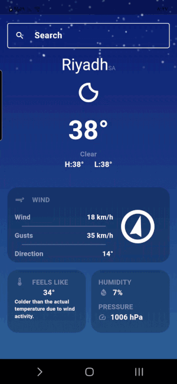
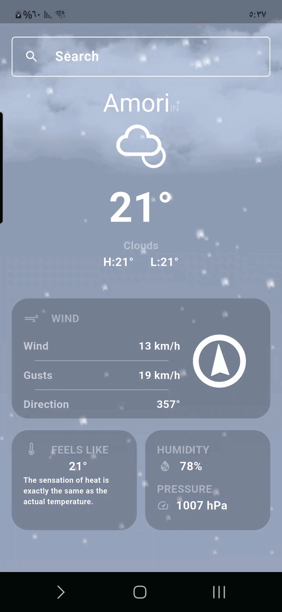

# weather

A Flutter project displays the weather forecast for the day.

## Features

Depending on data from openweathermap.org this app:
- Show weather state using `FutureBuilder`.
- Allow searching for weather in another area. 
- Beautiful animated backgrounds.

## Used technology
- Interfaces and logic **Flutter & Dart**
- API to connect to server **HTTP Package**.
- For data storage **REST API / JSON**.

## Requirements 
- Flutter SDK
- Internet connection
- API Key

## How to run
- Create your own API key and add it to the project.

## Screenshots

